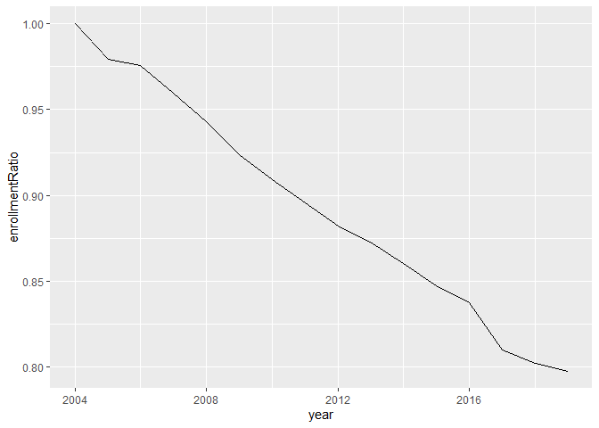
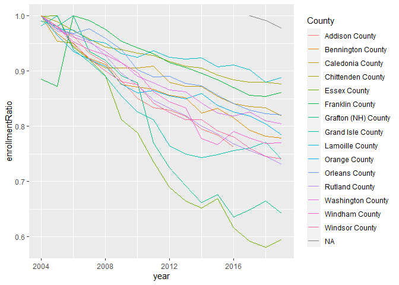

Burlington, VT, School Enrollment
================
Alex Reutter
2017-10-20

The purpose of this project is to help shed some light on questions surrounding enrollment in schools in Vermont, especially the Burlington district. It is a reference from which easier-to-consume conclusions and recommendations can be drawn.

Background
----------

The school district of Burlington, VT, is in its nth consecutive year of staff cuts, and parents are concerned about whether these cuts will adversely affect the quality of education provided by the district.

Summary
-------

While there is good evidence that statewide and Chittenden countywide enrollment is dropping, the data show that Burlington's K-12 enrollment has been stable over the last 14 years, and the expansion of the Pre-K program has actually increased total enrollment since 2003.

Data sources
============

Vermont Agency of Education
---------------------------

The VT Agency of Education (VTAoE)maintains a [portal where you can download reports of enrollment at Vermont’s Public schools](http://edw.vermont.gov/REPORTSERVER/Pages/ReportViewer.aspx?%2fPublic%2fEnrollment+Report). The data goes back to the 2003-2004 school year. Because it is time-consuming to submit the requests and download the data, I have saved original copies of Excel exports produced by the portal in this public GitHub repository.

Burlington School District Annual Reports
-----------------------------------------

The school district produces [annual reports](http://district.bsd.schoolfusion.us/modules/cms/pages.phtml?pageid=309846) that are publicly available. The numbers from the BSD Annual Reports are slightly different from the VTAOE numbers; my understanding is that this is because the numbers in each of the reports are pulled at different times of the school year, and enrollment fluctuates over the course of the school year.

The plots in this project are based on the VTAoE data.

Analyses
========

In order to make this analysis open and replicable, the code used to produce the analysis in this public GitHub repository. At the moment, I am using R code to work with the data. The source .

Processing the original reports
-------------------------------

Unfortunately, the VTAOE reports are not in good condition for performing further analysis. In order to get the data into shape, I wrote the data processing.r file. This processing file combines the reports and restructures them into a single dataset with the following columns:

-   School, which identifies the school
-   OperatingDistrict, which identifies the operating district the school is a part of
-   SupervisoryUnion, which identifies the supervisory union or school district that the operating district is a part of
-   County, which identifies the county in which the supervisory union operates
-   Grade, which identifies the grade for which enrollment is reported. VTAOE does not have classroom-level data
-   Year, which identifies the year that the school term ends; thus, rows with the value 2014 for Year report enrollment for the 2013-2014 school year
-   Enrollment, which is the number of students enrolled in a given year in a given grade at a given school

State-level analysis
--------------------

It is clear that, across Vermont, total K-12 enrollment is decreasing. The plot below shows that the rate of decline differs from county to county. There is a separate line to represent each county, which shows the enrollment in that county, relative to the maximum enrollment observed over the last 13 years. Essex and Grafton counties have experienced the most severe declines, while Lamoille and Chittenden county have seen the least declines.

I am displaying a ratio rather than the total enrollment because this makes the year-to-year changes easier to compare across counties.

Chittenden county-level analysis
--------------------------------

Let’s look more closely at the supervisory unions and school districts within Chittenden county. This is the same style of plot as shown for comparing the county-to-county enrollment, but here there is a separate line to represent each supervisory union or school district.

What this plot shows is that, within Chittenden county, most districts appear to be experiencing a decline in K-12 enrollment; however, Burlington has held steady.

